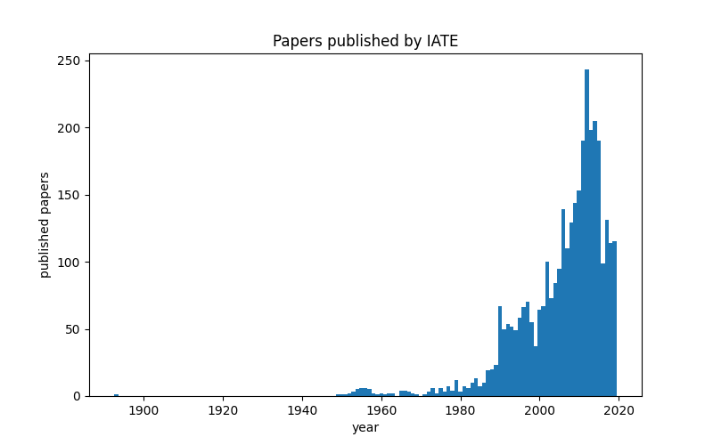
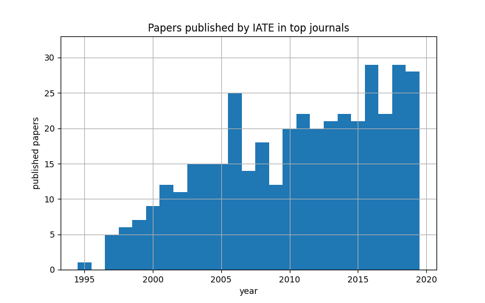
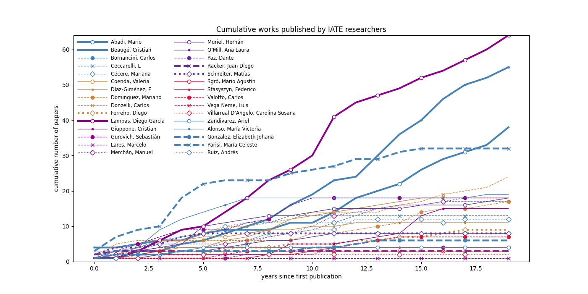
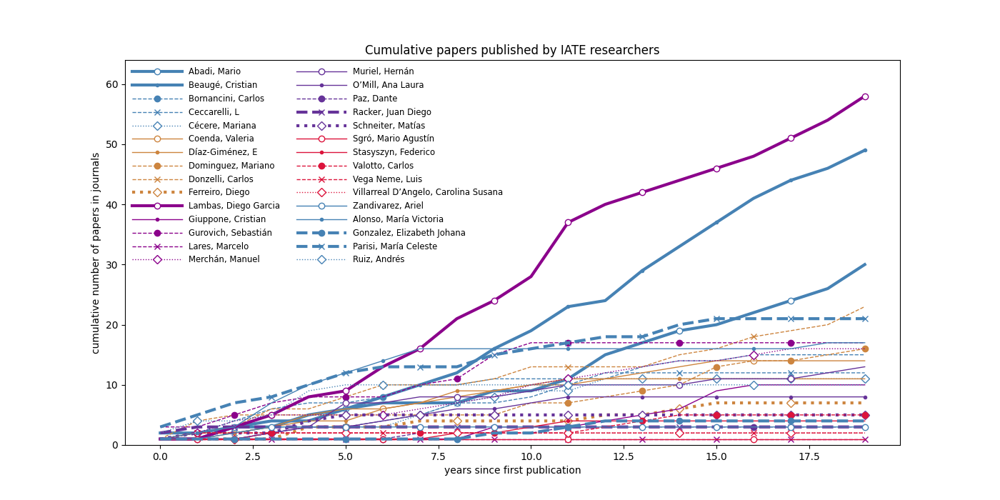
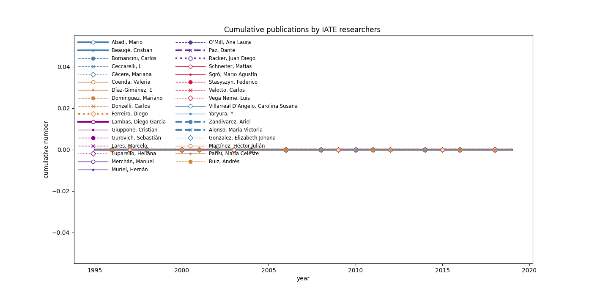
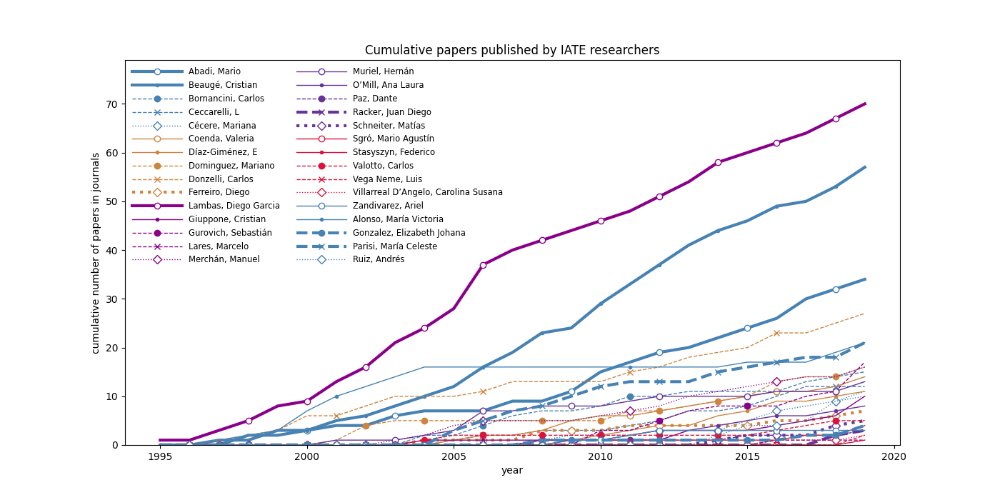
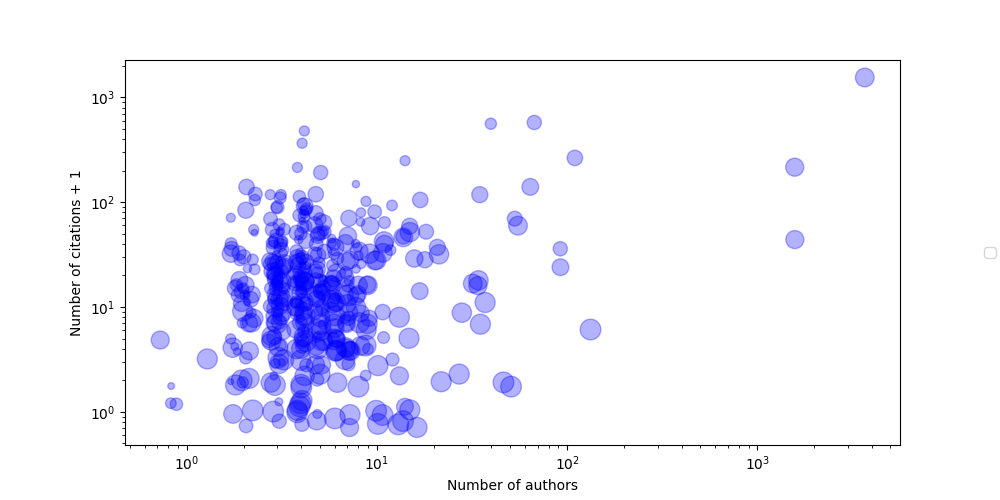
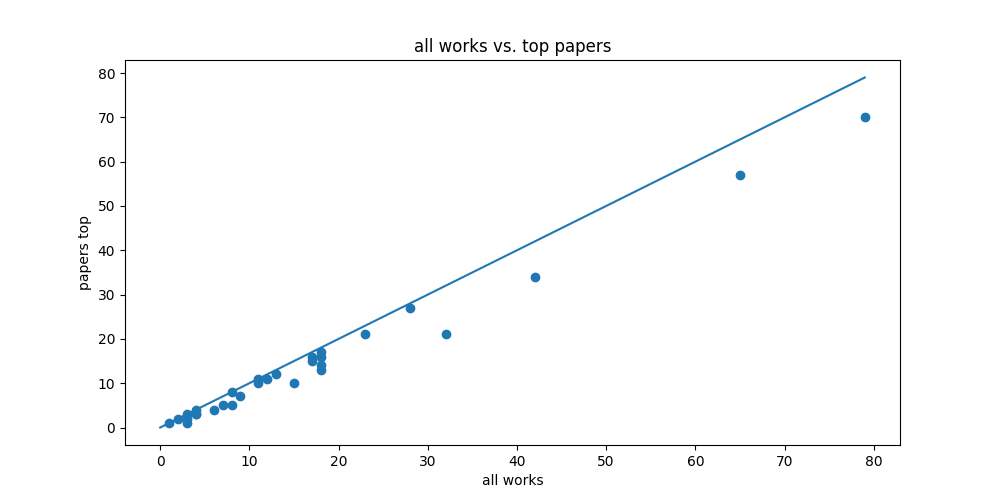
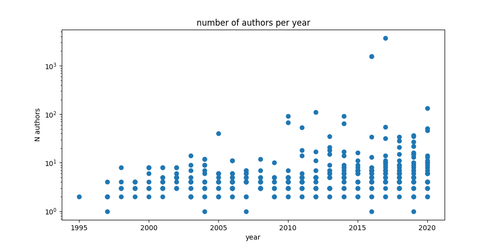

***************************
Informe del estado del IATE
***************************

Numero de papers con autores investigadores, para todas las
publicaciones y para las revistas más importantes (i.e., excluyendo
proceedings y BAAA):

Eolución de las publicaciones por autor (hay papers que aparecen para
varios autores), contando el tiempo en años o contando desde el año de
la primera publicación.

Relación entre la cantidad de citas y el número de autores:

en general, los papers con más autores tienen más citas.

Relación entre la cantidad de publicaciones y el número de papers en
revistas top.

Evolución de la cantidad de autores en función del tiempo:

se puede ver que hay un leve incremento en la cantidad de autores de
los papers.

